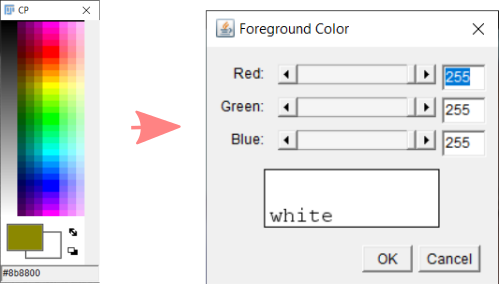

## ImageJ installation
Go to this [link](https://imagej.net/software/fiji/). Dowload the .zip file, extract and you are done. 

Optional - A plugin suitable for 3D analysis is MorphoLibJ under the plugin IJPB. To install this plugin, open imagej go to help --> press "update.." it will check for the updates and another window will appear. Press "Manage update sites". Under name find "FIJI", "3D imageJ suite" and "IJPB plugins"; and check the boxes on the left. Then close the current window and press "Apply changes" in the previous window and let it install, once done restart and imageJ is ready. You can open imageJ and under plugin check if you can see MorphLibJ.

## Annotating data set for training

The goal of this step is to identify different phases in your image and identify them (associated pixels) with an integer (1,2,3). 

1. Open imageJ and the main window will appear as shown below
 
2. Open image --> file - open image from file explorer or simply drag and drop
3. Adjust the contrast level if needed --> Image - Adjust - Brightness/contrast --> adjust the scroll bar
4. Change the image to 8-bit --> Image - Type - 8-bit
5. Once you identify the region to be labelled - zoom in --> press icon 2 shown in step 1 - click on the region in the image to zoom in. To zoom out press right click.
6. Now we define the value of the pixel to be drawn --> press icon 3 shown in step 1 - a window with name "CP" will appear, double click anywhere inside the window and the "Foreground color window would appear."  
 
7. Make RGB value as 255. Press OK and close the CP and Foreground color window. Now the value of the pixel you will draw is fixed.
8. Now choose icon 4 "Pencil tool", now you have a pencil in your cursor. To control the size of the pencil tip, double click on the icon and scroll depending on the size of the pixel you need.
Note - In case you do not see the "Pencil tool", click the ">>" symbol icon 5, and select drawing tool, then the necessary ioncs will appear in the main window.
9. Use the cross wire and select the pixel to draw, when you hover your mouse on the pixel you have drawn you can see the value of the pixel on the main window saying "Value = 255". This confirms you have made/drawn those pixels as 255.
10. Repeat the procedure and color the remaining pore region.
11. Once you have finished coloring all the pores, the image should be converted to a binary, i.e. the pores should have value "1" and the remaining region should have value "0".
12. To do this, we threshold the image. --> Press Image - Adjust - Threshold --> window 1 and 2 will appear
  
13. Set the range between 250 - 255 for example in window "2", Use "Default" and "B&W" in the drop down menu, uncheck all the boxes. The threshold results appears as window "3". IF you are happy, press "Apply".
14. In the resulting image the color is inverted. That is 255 pixels appear black and background appearing white. To invert this go to --> Image - Lookup tables - Grays. This will invert the image as shown in window 4.
15. To change the value from 255 to 1 --> Process - Math - divide by 255. 
16. You have annoted the image. Now you can save --> File save as.
17. Repeat 1-16 to annotate other training images.

## Annotating multiple phases in the image
 To annote multiple imagee, you have draw different phases with different pixel values such as 1,2,3,4, depening on the number of phases. There are two option, 1. Annotate each phase as binary following step 1-16 in the previous section then add the images together, or 2. color different phases on the single image by changing the pixel value mentioned in step "6-7". An example of two phase annotation is shown below. Here I used the same image shown above where we only annotated the pores, however, here the non-pore region is also annotated with a value. (I did not do a good job here). Here, the dark region have value "1" and white region have value "2". Once done you can save the image and redo this procedure for other images to annotate for the training.
  
  
  
  
 ## Extras
 
  ### Morphiolib for image analysis - [link](https://imagej.net/plugins/morpholibj)
  ### Weka segmentation  - [link](https://imagej.net/plugins/tws/)
